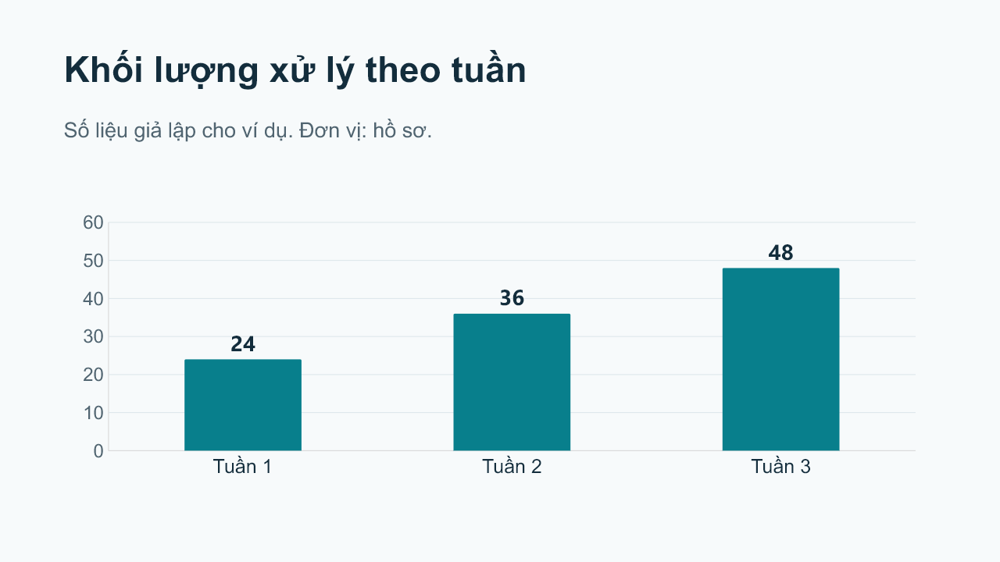

# Superpowerpoint

Bộ Agent Skills để tạo, chỉnh sửa và kiểm tra PowerPoint.

Quy trình: **yêu cầu → dàn ý → thiết kế → tạo hoặc sửa slide → kiểm tra → bàn giao**. Có thể thực hiện toàn bộ một lần, hoặc đi thẳng vào một thao tác nhỏ. Hỗ trợ nội dung tiếng Việt và giữ văn bản, bảng, biểu đồ ở dạng có thể chỉnh sửa.

## Bắt đầu

Đây là bộ skill dùng trong Codex, không phải add-in cài vào ứng dụng PowerPoint. Cần Git và Python 3.10 trở lên để cài theo các bước dưới đây. Bộ cài và công cụ kiểm tra chỉ dùng thư viện tiêu chuẩn, không cần API key.

Tải dự án về máy rồi chuyển vào thư mục dự án:

```text
git clone https://github.com/HIspcvn/superpowerpoint.git
cd superpowerpoint
```

Nếu đã có repository trên máy, mở Terminal tại thư mục đó. Kiểm tra và cài skill:

```text
python scripts/validate_repo.py
python scripts/install_skills.py --dest .agents/skills --dry-run
python scripts/install_skills.py --dest .agents/skills
```

Lệnh cuối cài cả 6 skill vào phạm vi repository để các tài liệu tham chiếu chéo hoạt động. Bộ cài từ chối ghi đè nếu bất kỳ skill đích nào đã tồn tại. Có thể chọn một thư mục skill khác bằng `--dest`; không có vị trí cài toàn máy mặc định. Khi cập nhật, kiểm tra bản đang dùng và chọn đích mới nếu cần giữ lại thay đổi của bạn.

Mở thư mục dự án này trong Codex, rồi tạo task mới để bắt đầu dùng. Codex khám phá skill trong `.agents/skills`; nếu danh sách chưa cập nhật, khởi động lại Codex. Bản cài theo hướng dẫn trên chỉ áp dụng trong repository này. Xem [tài liệu chính thức](https://learn.chatgpt.com/docs/build-skills). Repository cũng có [manifest plugin Codex](.codex-plugin/plugin.json), chưa tự đăng ký hoặc xuất bản lên marketplace. Tránh cài đồng thời bằng cả hai cách để không lặp skill.

Sau khi cài, gọi:

```text
$superpowerpoint Tạo 6 slide tiếng Việt giới thiệu sản phẩm của tôi.
Người xem là khách hàng mới, trình bày 10 phút. Dùng tài liệu đính kèm,
giữ số liệu có nguồn, tạo biểu đồ chỉnh sửa được và thực hiện toàn bộ.
```

Hoặc dùng trực tiếp một công đoạn:

```text
$editing-powerpoint Chỉ sửa tiêu đề slide 2 trong file đính kèm,
giữ nguyên phần còn lại và lưu một bản mới.
```

## Sáu skill

| Skill | Công việc |
| --- | --- |
| [superpowerpoint](skills/superpowerpoint/SKILL.md) | Điều phối yêu cầu, chọn đúng quy trình và giữ phạm vi |
| [planning-powerpoint](skills/planning-powerpoint/SKILL.md) | Brief, nguồn dữ liệu, dàn ý từng slide và kế hoạch thực hiện |
| [designing-powerpoint](skills/designing-powerpoint/SKILL.md) | Mẫu, thương hiệu, font, bố cục và thiết kế nhất quán |
| [building-powerpoint](skills/building-powerpoint/SKILL.md) | Chọn công cụ có sẵn và tạo nội dung chỉnh sửa được |
| [editing-powerpoint](skills/editing-powerpoint/SKILL.md) | Sửa có phạm vi, bảo toàn định dạng và tính năng cần giữ |
| [reviewing-powerpoint](skills/reviewing-powerpoint/SKILL.md) | Kiểm tra nội dung, cấu trúc, hình ảnh và khả năng dùng file |

Các hướng dẫn chỉ yêu cầu hỏi thêm khi thiếu thông tin ảnh hưởng đáng kể tới kết quả. Yêu cầu làm toàn bộ không bị biến thành chuỗi xin duyệt lại từng bước. Không tự thêm slide mở đầu vượt số lượng yêu cầu, bịa nguồn hoặc thay biểu đồ cần chỉnh sửa bằng ảnh.

## Tạo và xem PowerPoint

Skill hướng dẫn tác nhân sử dụng công cụ trình chiếu có trong môi trường; bản thân Markdown không phải một phần mềm dựng slide. Tạo file và render cần một thư viện, connector hoặc ứng dụng phù hợp. Ưu tiên skill Presentations có sẵn nếu môi trường cung cấp. Xem [các cách tích hợp](skills/building-powerpoint/references/capability-adapters.md).

[Ví dụ 4 slide tiếng Việt](examples/demo/output/superpowerpoint-demo.pptx) có [brief](examples/demo/brief.md), [mã dựng](examples/demo/build_demo.mjs), [hướng dẫn chạy lại](examples/demo/README.md) và ảnh xem trước từng slide. Ví dụ dùng runtime `@oai/artifact-tool` do môi trường cung cấp; không yêu cầu thư viện này cho các công cụ Python.



## Kiểm tra file PPTX

```text
python skills/reviewing-powerpoint/scripts/inspect_pptx.py examples/demo/output/superpowerpoint-demo.pptx --expect-slides 4 --require-chart 2 --require-table 3
```

Thêm `--json` để lấy báo cáo có cấu trúc. Có thể lặp `--require-chart` và `--require-table` cho nhiều slide; số slide bắt đầu từ 1. `--min-font-pt 14` cảnh báo cỡ chữ khai báo nhỏ hơn ngưỡng, không suy ra cỡ chữ kế thừa từ mẫu.

Công cụ đọc thứ tự slide thực, kích thước, văn bản, ghi chú, slide ẩn, quan hệ giữa các thành phần và bằng chứng đối tượng gốc. Nó không sửa file, giải nén ra đĩa, mở đường dẫn bên ngoài hoặc chạy macro.

| Mã kết thúc | Ý nghĩa |
| --- | --- |
| `0` | Không có lỗi cấu trúc hoặc yêu cầu kiểm tra bị vi phạm; vẫn có thể có cảnh báo |
| `1` | Có lỗi cấu trúc hoặc không đáp ứng số slide/đối tượng được yêu cầu |
| `2` | Tham số sai, không đọc được file ZIP/PPTX hoặc vượt giới hạn đọc an toàn |

Kiểm tra XML không chứng minh slide đẹp, đúng sự thật, không tràn chữ hoặc hoạt động hoàn chỉnh trong PowerPoint. Quy trình skill yêu cầu xem bản render và ghi rõ những bước chưa thực hiện.

## Phát triển và kiểm thử

```text
python scripts/validate_repo.py
python -m unittest discover -s tests -v
```

Validator kiểm tra cấu trúc của bộ skill, metadata, liên kết nội bộ và manifest. Test tự động kiểm tra các công cụ; [các ca đánh giá hành vi](evals/README.md) kiểm tra quyết định của tác nhân, được thực hiện riêng. [CI](.github/workflows/validate.yml) có cấu hình Windows và Ubuntu, Python 3.10 và 3.13.

Xem [kế hoạch triển khai](docs/implementation-plan.md) và [kết quả kiểm chứng cùng giới hạn](docs/validation.md). Dự án phát hành theo [MIT](LICENSE); thông tin về thư viện tuỳ chọn nằm trong [third-party notices](THIRD_PARTY_NOTICES.md).
